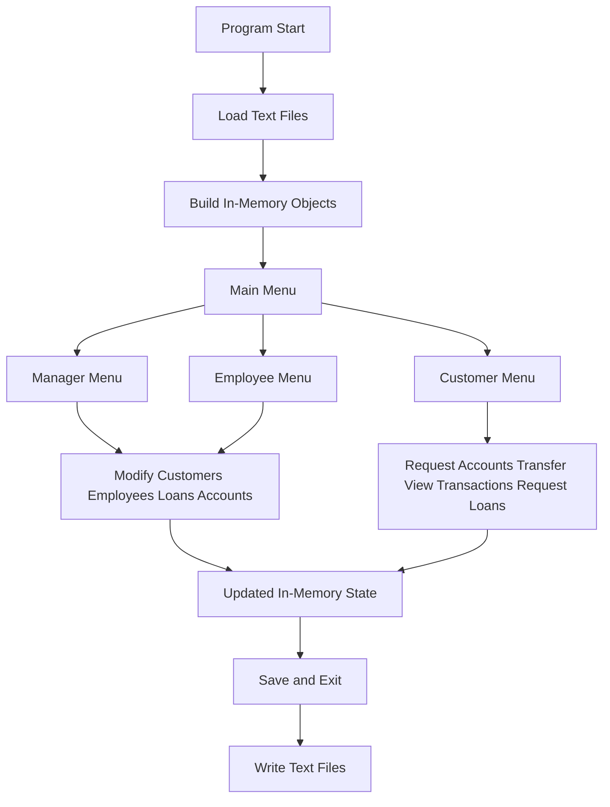
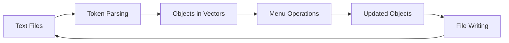

# Role-Based Bank Management System in C++

Before we go further, just check one prerequisite: this project is a **Windows-oriented C++ console application**, and the source currently includes headers such as `conio.h`, so the easiest way to build it is with a Windows C++ toolchain such as MinGW or Visual Studio.

This repository contains a **single-file, role-based banking management system** written in C++. Even though the code lives inside one `main.cpp`, the project is not a tiny toy example. It already has:

- object-oriented domain modeling
- separate user roles
- account and loan workflows
- transaction history
- text-file persistence
- startup loading and save-on-exit behavior

So the important point is this: the code is physically small in structure, but logically it already behaves like a compact banking back-office simulator.

## Roadmap of This README

1. What problem does this project solve?
2. What is the high-level architecture?
3. How does each class participate in the system?
4. How does the application flow work from startup to save?
5. How is data stored?
6. How do you build and run it?
7. What are the current limitations and next improvements?

---

## 1) What problem does this project solve?

If I want to explain it very simply, this program simulates the basic operations of a small bank using a **console menu system**.

There are three main actors:

- **Manager**
- **Employee**
- **Customer**

Each actor enters a different menu and performs different actions. For example:

- the manager can manage employees, customers, loans, and account requests
- the employee can manage customers, accounts, loans, and transactions
- the customer can request accounts, transfer money, view transactions, and request loans

Suppose you do not want a random user to add a loan or create an employee record. Then you need **role-based access control**. That is exactly the core idea here.

So this means the project is not just "bank data in a file". It is a **role-based console banking workflow**.

---

## 2) What is the high-level architecture?

Before we dive into class-by-class details, let us first look at the system from far away.

### Visual A: Global system map



If you look carefully, the application has two big halves:

1. **In-memory runtime logic**
2. **Plain-text persistence**

At the beginning, the program reads saved files and reconstructs objects. During execution, everything happens in memory using vectors and classes. At the end, the state is written back to disk.

So this means the program behaves like a tiny database-backed system, except the "database" here is a set of text files.

### Visual B: Local OOP structure

```text
Person
 ├── Customer
 ├── Employee
 └── Manager

Customer
 ├── vector<Account>
 └── vector<Loan>

Account
 └── vector<Transaction>
```

This is the core object model. `Person` is the base abstraction. Then specialized roles grow from it.

### Visual C: Before and after state

| Stage | What exists? |
|---|---|
| Before startup | Plain text files such as `customer`, `employee`, `account` |
| During execution | `Customer`, `Employee`, `Account`, `Loan`, and `Transaction` objects inside vectors |
| After save | Updated text files written back to disk |

That is the whole application lifecycle in one table.

---

## 3) How does each class participate in the system?

Now let us go piece by piece.

### 3.1 `Person`

`Person` is the base class for identity and authentication-related fields.

It stores:

- national ID
- first name
- last name
- date of birth
- gender
- join date
- password
- login state

The formal idea here is **inheritance**.

Suppose three different user types all need identity fields and login-related behavior. If you duplicate those fields in every class, the code becomes repetitive very quickly. So `Person` acts as the common base.

So this means `Person` is the shared identity layer of the system.

### 3.2 `Transaction`

`Transaction` is a small record object that stores:

- a description
- an amount

This class is simple, but important. Whenever deposit or withdrawal happens, a `Transaction` object is pushed into an account history.

Suppose an account balance changes from `1000` to `1200`. Without transaction history, you only know the current number. With a `Transaction`, you also know **why** the number changed.

So this means `Transaction` is the explanation layer behind balance movement.

### 3.3 `Account`

`Account` stores:

- account ID
- current balance
- account type
- transaction list

The main behaviors are:

- `deposit`
- `withdraw`
- `displayInfo`
- `displayTransactions`

Here the formal idea is **encapsulation**: the balance lives inside the account, and the account methods control how that balance changes.

Suppose an account has balance `500`, and the user deposits `200`. The new balance becomes `700`, and a matching transaction record is created. The same idea happens for withdrawal, as long as the amount does not exceed the balance.

So this means `Account` is not just a data container. It is the main financial behavior unit.

### 3.4 `Loan`

`Loan` stores:

- loan ID
- interest rate
- amount

This is a compact data model for loan offerings and granted loans.

Suppose a customer requests loan `101`, and the system later assigns a loan object with amount `50000` and rate `0.18`. That loan can then be displayed back to the user or attached to the customer profile.

So this means `Loan` is the banking-credit object in the system.

### 3.5 `Customer`

`Customer` inherits from `Person` and extends the base identity model with:

- `vector<Account> accounts`
- `vector<Loan> loans`

Key customer operations include:

- viewing accounts
- viewing transactions
- transferring money
- viewing loan information
- login

Suppose a customer has two accounts and one active loan. That customer object becomes a small personal banking container holding both assets and liabilities.

So this means `Customer` is the richest user entity in the program, because it owns the most business data.

### 3.6 `Employee`

`Employee` also inherits from `Person`.

Its job is more operational. Through the employee menu, it can:

- add customers
- edit customers
- delete customers
- manage loans
- review transactions
- handle account-related requests

The formal role here is **staff-side operations**.

Suppose a customer asks for a new account. That request first exists as a pending request in memory, and then an employee processes it.

So this means the employee is the bridge between customer requests and system execution.

### 3.7 `Manager`

`Manager` is the highest-privilege role in the current implementation.

One important detail is that manager authentication is currently hardcoded:

- username: `admin`
- password: `1234`

Now you might ask: "Is that realistic for a production system?"

The answer is no. But for a learning-stage console banking system, it is a simple way to separate the admin path from the rest of the program.

So this means `Manager` currently acts like a built-in administrator role, not a fully persisted enterprise user.

### 3.8 `mainClass`

This class is the central application state container.

It keeps:

- all customers
- all employees
- all accounts
- all loans
- account creation requests
- account deletion requests
- loan requests
- current session IDs for logged-in users

If the other classes are the domain objects, `mainClass` is the **runtime state hub**.

Suppose the customer menu adds an account request and the manager menu later approves it. That shared interaction happens because both sides work through the same `mainClass` state.

So this means `mainClass` is the memory-resident coordination layer.

---

## 4) How does the application flow work?

Let us now move from static structure to actual behavior.

### 4.1 Startup phase

At startup, `main()` reads text files such as:

- `employee`
- `customer`
- `account`

Then it tokenizes comma-separated fields and rebuilds C++ objects.

This is basically a tiny manual deserialization pipeline.

Suppose a line in the `customer` file contains personal fields. That line is split into tokens, then used to construct a `Customer` object, and finally stored inside `mClass.customers`.

So this means the application boot process is: **read text -> split fields -> build objects -> populate vectors**.

### 4.2 Main menu phase

Once the data is loaded, the application enters `mainMenu`.

From there, the user chooses one of three paths:

- Manager
- Employee
- Customer

This is the top-level routing layer of the program.

### 4.3 Manager flow

The manager menu contains higher-level administrative operations such as:

- login
- employee management
- customer management
- loan management
- account creation and deletion processing
- transaction listing and search

The manager role is effectively the supervisory control panel.

### 4.4 Employee flow

The employee menu focuses on day-to-day banking operations:

- customer CRUD actions
- loan CRUD actions
- account creation and deletion workflows
- transaction review

If the manager is the strategic controller, the employee is the operational worker.

### 4.5 Customer flow

The customer menu is the client-facing path.

It includes:

- login
- request to add account
- request to delete account
- list accounts
- transfer money
- list transactions
- request loan
- list current loans
- view available loans

Suppose a customer wants a new account. They do not create it directly. Instead, they send a request, and that request gets stored for later processing.

So this means the customer path is intentionally more restricted than the staff paths.

---

## 5) How is data stored?

This part is very important because the system does not use a relational database.

Instead, it stores data in plain files:

- `customer`
- `employee`
- `account`
- `customerloan`
- `loan`

### Persistence idea

The persistence model is:

1. load files on startup
2. operate in memory
3. write files on save-and-exit

### Visual: persistence flow



If you look carefully, this is effectively a very small **state serialization cycle**.

Suppose a customer receives a new account during the session. That account lives in memory first. It becomes permanent only when the program reaches the save section and writes the account data back to disk.

So this means persistence here is not live-sync. It is **session-based save persistence**.

---

## 6) How do you build and run it?

Since no compiler is installed in this environment, I did not claim a successful local build here. But the intended build path is straightforward on Windows.

### Option A: MinGW g++

```bash
g++ main.cpp -o bank_system.exe
bank_system.exe
```

### Option B: Visual Studio Developer Command Prompt

```bash
cl /EHsc main.cpp
main.exe
```

### Runtime note

When the program runs, it may create or update these data files in the working directory:

- `customer`
- `employee`
- `account`
- `customerloan`
- `loan`

Because those are generated runtime data files, they are ignored in `.gitignore`.

So this means the repository tracks the source code and documentation, not the user-generated bank state.

---

## 7) What are the current limitations?

Now let us be honest about the current shape of the project.

### 7.1 Everything is in one source file

All classes, menus, loading logic, and saving logic live inside `main.cpp`.

That is workable for a course project, but once the project grows, it becomes harder to maintain.

### 7.2 Manager credentials are hardcoded

The manager login currently checks:

- `admin`
- `1234`

This is useful for testing, but not secure for a real system.

### 7.3 Text-file persistence is fragile

Flat text files are simple, but they are also error-prone:

- format mistakes can break loading
- there is no schema enforcement
- there is no transaction safety

### 7.4 There are some logic inconsistencies

For example, different session ID fields such as `currentCustomerId`, `currentEmpId`, and `currentManagerId` are used across different menus, and the code would benefit from cleanup and stricter separation of responsibility.

So this means the project already has a solid learning architecture, but it is still at the **course-project / prototype stage**, not at the production-banking stage.

---

## 8) What would be the best next improvements?

If I wanted to evolve this project into a stronger software-engineering piece, I would go in this order:

1. Split `main.cpp` into modules such as `person`, `account`, `loan`, `menus`, and `storage`
2. Replace plain-text persistence with SQLite or another lightweight database
3. Hash passwords instead of storing them as raw strings
4. Replace hardcoded manager login with persisted admin records
5. Add stronger validation for account operations and transfer rules
6. Introduce service classes for account management, customer management, and persistence

Suppose you make only one improvement. The highest-leverage one would be separating the storage layer from the menu layer. That single change would immediately make the code easier to test and maintain.

So this means the cleanest next architectural step is **modularization plus safer persistence**.

---

## 9) One likely question

Now you might ask: "If this is still a console app with text files, is it still a meaningful project?"

Yes, absolutely. Because the project already teaches several important software concepts at the same time:

- inheritance
- encapsulation
- role-based behavior
- state management
- persistence
- interactive CLI flow

In other words, this is not just a `cout` exercise. It is already a compact **domain-driven C++ application skeleton**.

So this means the value of the project is not only in what it does, but also in the software design ideas it already introduces.

---

## Short Recap

This project is a **role-based console banking system in C++** with:

- a base `Person` model
- specialized user roles
- accounts, loans, and transactions
- menu-driven workflows
- file-backed persistence
- save-on-exit behavior

If I want to say it very directly: this repository shows how a small but real banking workflow can be modeled in C++ using object-oriented design, even before bringing in databases, GUIs, or web frameworks.

That is the whole idea.
